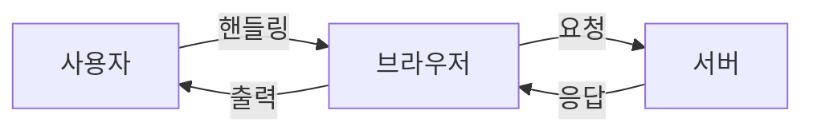

# 브라우저의 작동 원리
{: .no_toc }

## Table of contents
{: .no_toc .text-delta }

1. TOC
{:toc}

---

## 웹 브라우저

웹 서버에서 양방향 통신을 하며 HTML 등의 컨텐츠를 열고 하게 해주는 GUI 기반 프로그램입니다.

## 통신 흐름도

## 동작 원리

### 자원 요청

1. **HTTP 프로토콜**
   - DNS 서버에서 전달받은 IP주소와 URL 정보로
   - HTTP 프로토콜을 사용하여 HTTP 요청 메시지를 생성

2. **TCP/IP 프로토콜**
   - HTTP 요청 메시지를 TCP 프로토콜로 사용하여
   - 인터넷을 거쳐 해당 IP의 컴퓨터로 전송

3. **응답 처리**
   - 그렇게 도착한 HTTP 요청 메시지는 다시
   - HTTP 프로토콜을 이용하여 URL 정보로 변환
   - 응답은 역순으로 전달

## 정리

브라우저는 웹 서버와의 통신에서 HTTP와 TCP/IP 프로토콜을 사용하여 자원을 요청하고 응답을 받아 처리하는 GUI 기반의 프로그램입니다. 이를 통해 사용자는 웹 페이지를 쉽게 탐색하고 상호작용할 수 있습니다. 